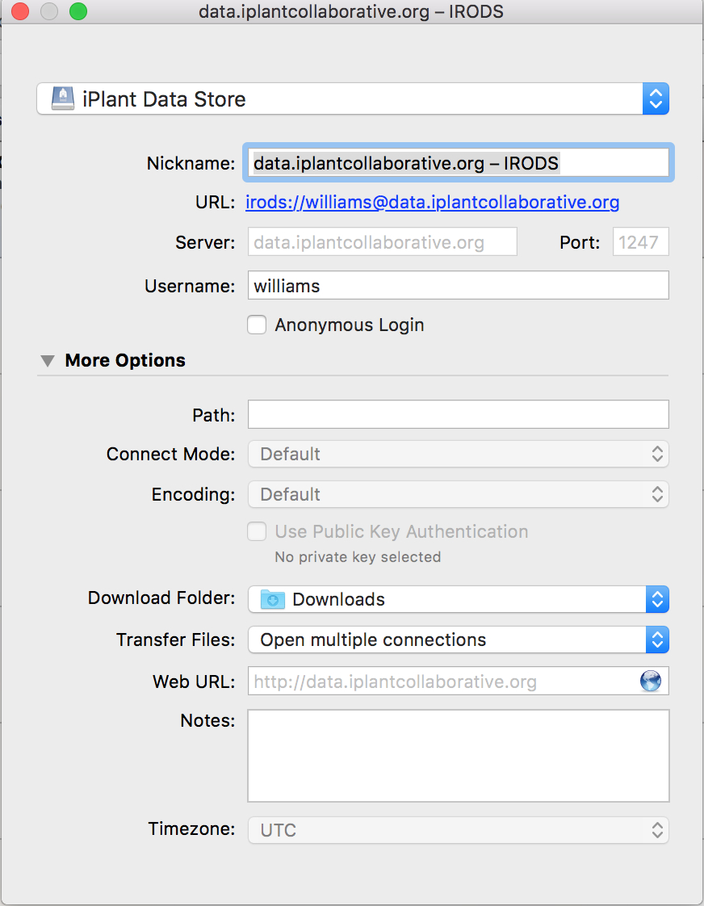
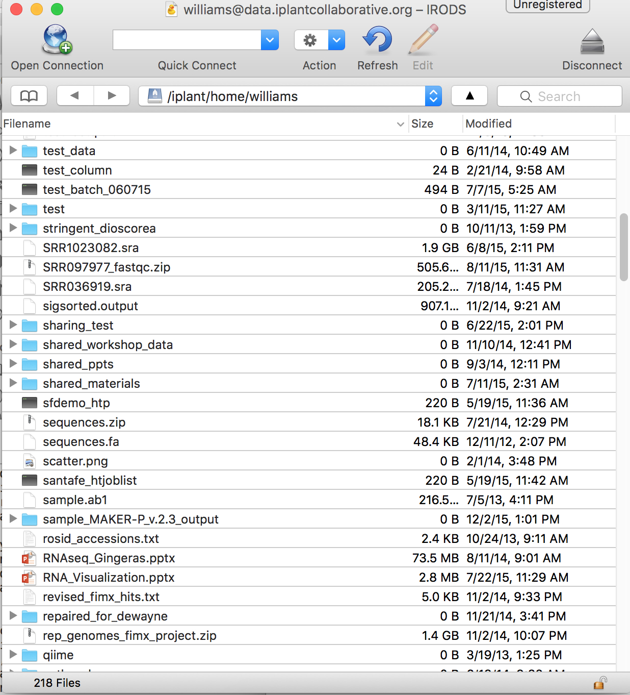

# Data Overview

The CyVerse Data Store unifies all CyVerse cyberinfrastructure. In practical terms this means that though the interfaces to the Data Store differ (e.g. Cyberduck, iDrop, iCommands, Discovery Environment, APIs, etc.) they are all operating on the same system – giving you the freedom to move between platforms. Here are some solutions for common data management tasks in CyVerse:

## Key Data Store features

- 100 GB allocation per user (you may [request additional storage](http://www.cyverse.org/content/increase-your-data-store-allocation))
- Data are automatically backed up
- Optimal transfer speeds 100GB transfer ~30 min. 
- iRODS grid storage provides powerful data management tools for metadata and sharing

## Quick recommendations
|Task|Recommendation|
|----|--------------|
|Upload or Download files (including large files, large numbers of files, and/or folders)|Use the Cyberduck data transfer application (for Windows, Mac)|
|Share Data with other CyVerse users (files or folders) or create Public URLs to specific datasets|Use the Discovery Environment (any web browser)|
|Manage metadata for single files or large collections of files|Use the Discovery Environment (any web browser) or iCommands|
|Write scripts or work in the terminal/shell to manage data|Use iCommands
 
# Connecting to Data Store with Cyberduck

Cyberduck is a user-friendly standalone application that can serve the majority of use cases for the majority of users. Feel free to upload any data you wish to analyze, especially in the context of the workshop. If you don’t have sample data, just upload any document as a test.

## Downloading and configuring Cyberduck

### Download Cyberduck

1. Go to the Cyberduck installation page at [https://cyberduck.io/](https://cyberduck.io/)
2. Follow the steps for your OS (not available for LINUX users):
    - For Mac OS: Click Download Cyberduck-4.7.1.zip (or later version than 4.7.1).
    - For Windows: Click Download Cyberduck-Installer-4.7.1.exe (or later version than 4.7.1, if displayed).

### One-time configuration of Cyberduck for use with CyVerse

1. Download the [CyVerse configuration profile](https://pods.iplantcollaborative.org/wiki/download/attachments/18188197/iPlant%20Data%20Store.cyberduckprofile?version=1&modificationDate=1436557522000&api=v2) 
2. Double-click on the downloaded profile, Cyberduck should automatically start.  
3. Verify iPlant Data Store is displayed in the first field.
4. In the Nickname field, enter **data.iplantcollaborative.org – iRODS**
5. Create a connection that uses your CyVerse user account for login (Optionally: you may create an anonymous connection to access public data without an iPlant user account - see full [CyVerse documentation](https://pods.iplantcollaborative.org/wiki/display/DS/Using+Cyberduck+for+Uploading+and+Downloading+to+the+Data+Store)
6. In the populated URL field, verify **irods://data.iplantcollaborative.org** is displayed.
7. In the Server field, enter **data.iplantcollaborative.org.**
8. In the Port field, enter **1247**.
9. In the Username field, enter your CyVerse user name.
10. Verify your username is added to the URL field (e.g.: irods://yourusername@data.iplantcollaborative.org.)
11. In the More Options section, select Open multiple connections in the Transfer Files drop-down list.

**Example completed Cyberduck configuration**


## Uploading and downloading from the Data Store with Cyberduck

In the Cyberduck window, double-click a bookmark.
Log in to Cyberduck using your CyVerse username and password. By default, your Home folder is selected.

#### Upload to Data Store
- Drag the file and folder from your local computer to the desired location in you CyVerse Data Store. 

or 

- Click the Cyberduck File menu and then click Upload and select the file or folder to upload - the item is uploaded to your Home folder

#### Download from Data Store

- Drag the file and folder from your CyVerse Data Store to the desired location on your local computer. 

or 

- Click the file or folder to download and select the Cyberduck File menu and then click Download - the file is downloaded to your default download folder. 

> **Tip:** To navigate to a different folder (for example, to download a file from the Community Data folder)
   1. Click the Cyberduck Go menu and then click Go to Folder. 
   2. Enter the path to the folder (you may want to copy the path to the folder displayed in the DE Data window's Viewing field).For example, to go to the Data Store Shared folder, enter **/iplant/home/shared**; Click **Go**. 

**Cyberduck window connected to Data Store**


# Connecting to Data Store with iCommands

iCommands is a collection of commands for Unix and Windows that are used in the iRODS system to interact with the CyVerse Data Store. Many commands are very similar to Unix utilities. For example, to list files and directories, you use `ls` in Linux, but in iCommands you use `ils`.

While iCommands are great for all transfers and for automating tasks via scripts, they are the best choice for large files (2-100 GB each) and for bulk file transfers (many small files). For a comparison of the different methods of uploading and downloading data items


## Downloading and configuring iCommands

iCommands is available for Mac and Linux. You must download the binaries and configure them for use. We will not cover all of the iCommands here but some important resources include:

- Full CyVerse [iCommands Documentation](https://pods.iplantcollaborative.org/wiki/display/DS/Using+iCommands)
- iRODS official [iCommands Documentation](https://docs.irods.org/master/icommands/user/)

### Download iCommands
1. Select the iCommands binary for your platform:
    - For Mac: Download the [Mac binary](https://www.irods.org/binaries/irods3.3.icmds.mac.intel.tar).
    - For Linux: Download either the Linux [64-bit binary](http://www.iplantcollaborative.org/sites/default/files/irods/icommands.x86_64.tar.bz2) or the Linux [32-bit binary](http://www.iplantcollaborative.org/sites/default/files/irods/icommands.i386.tar.bz2).
2. Untar/decompress the download (e.g. `mkdir icommands && tar -xvf irods3.3.icmds.mac.intel.tar -C ./icommands`)

> **Tip:** You may wish to add iCommands to your path  information on how to add the resulting iCommands directory to your $PATH, see UNIX / Linux: [Set your PATH Variable Using set or export command](http://www.cyberciti.biz/faq/unix-linux-adding-path/)

### Configure iCommands

In a terminal window, enter the following to initialize iCommands and your Data Store connection: iinit

1. Initialize iCommands using the following command
```
$ iinit
```
2. You will then be asked to setup your account and will need to enter the following information:

|Prompt|Entry|
|------|-----|
|irodsHost|data.iplantcollaborative.org|
|port|1247|
|zone|iplant|
|irodsUserName|your CyVerse username|
|Current iRODS password|your CyVerse password|
3. Verify that you have connected to your Data Store; view the contents of your home directory using the following the *ils* command.

```
$ ils
```

## Uploading and downloading with iCommands

### Uploading to Data Store

To move data from a local source to the Data Store use the *iput* command. In this case we pass the -P option to see the progress of the transfer. 

```
$ iput -P remote_machine_file.txt .
```
**Tip:** in this case, the '.' stands for the current CyVerse working directory which is by default '/iplant/home/your-cyverse-username'

### Downloading from Data Store

Use the *iget* command to move files from the Data Store into your remote machine:

```
$ iget -P datastore_file.txt .
```

There are several other iCommands options (including how to use the -T option for more reliable big data transfers, and -r command for recursive transfers of directories - See [iCommands documentation](https://pods.iplantcollaborative.org/wiki/display/DS/Using+iCommands). 


## Sharing data with the Discovery Environment 

The [Discovery Environment](http://www.cyverse.org/discovery-environment) is a powerful web interface to data management tools, computation, and bioinformatics tools. In this tutorial, we will focus on data sharing features. 

### Sharing with a data link in the CyVerse Discovery Environment


All of the instructions in this section will focus on the Data Console:
<center></center>

1.	Log into the Discovery Environment [DE Login](https://de.iplantcollaborative.org/de)

2.	In the Data console, next to the file click the  icon or select a file you wish to share, then from the Share menu click via Public Link. **Note**, only individual files can be shared from a public link. 
3. In the “Manage Data Links” window, select the file you wish to share, and click Create. **Note:** The manage links menu will only display if you use the 'Share' menu, not the shortcut link icon. 
<br><center></center>  
4. A new URL should appear beneath the file name. Click on this URL and the click on Copy in order to be presented with a window that will allow you to copy the URL to your clipboard. Anyone who you share this link with will be able to download the file.
5. Deactivate a data link by selecting the file; from the Share menu click via Public Link. Clicking the  icon next to the links you wish to inactivate. Once you deactivate the link, anyone with whom you shared it with will no longer be able to access that data.
  